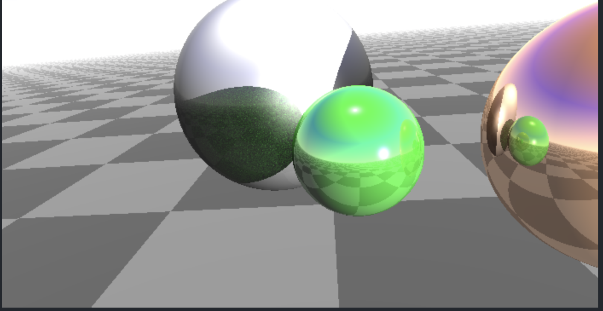

# TP2 Algorithme de rendu par lancer de rayons (ray-tracing ou eye-tracing)

## TP2 INFO 804 INFORMATIQUE GRAPHIQUE

Sujet : https://www.lama.univ-savoie.fr/pagesmembres/lachaud/Cours/INFO805/Tests/html/ig_tp2.html

## Screenshots
3.3

 

3.6


4.2



4.3


Try Emerald in Glass : 


Vision Infinie : 


Perfect Try with Wall and PeriodicPlane : 


## Authors

- [@YURTSEVEN Huseyin](https://github.com/Yuss9)
- [@DELIFER Paul](https://github.com/Zall9)


## Lancement des executables

<!-- # Question 1 : Visualiser une soupe de triangle et afficher le nombre de triangle
```bash
    ./executables/viewerQ1 bunny258.try
```

# Question 2 : Compression d'une soupe de triangle avec les 5 arguments
```bash
  ./executables/viewerQ2 bunny258.tri bunnyCompressed.tri 20 20 20
``` -->

Nous sommes actuellement à la question 5.2
